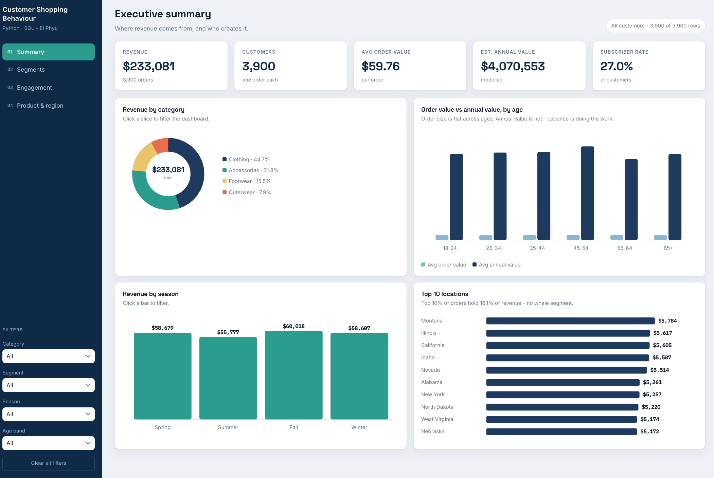

# Customer Shopping Behaviour Analysis

**Python · SQL · Interactive dashboard** — an end-to-end analytics project on a 3,900-customer
retail snapshot: data quality auditing and cleaning in Python, dimensional modelling and
analytical querying in MySQL, and a browser-based dashboard built on the resulting star schema.

**[Open the live dashboard](https://epiasoo.github.io/customer-shopping-behaviour-analysis/)**

<p align="center">
  
</p>

---

## The finding

> **30% of customers generate 72% of estimated annual value — and they get there by buying
> 4.3× more often, not by spending more per order.** Average order value between the two
> segments differs by just 1.23×.

Two commercial levers already in use — discounts and subscriptions — show **no detectable
effect on spend**. Every effect size came back negligible (Cliff's δ < 0.05), and discount
status is moderately associated with subscription status and gender (Cramér's V 0.70 / 0.60),
so it cannot be read as an independent driver. The recommendation is a randomised holdout test,
not a discount programme.

| Metric | Value |
|---|---|
| Customers / orders | 3,900 |
| Total revenue | $233,081 |
| Average order value | $59.76 |
| Estimated annual value | $4,070,553 |
| Category split | Clothing 44.7% · Accessories 31.8% · Footwear 15.5% · Outerwear 7.9% |
| Segments | High-value regulars 1,161 (71.6% of annual value) · Steady mid-tier 2,739 (28.4%) |
| Purchase cadence | 38.2 vs 8.8 purchases/year |
| Top-decile revenue share | 16.1% — no whale segment |

---

## What's in here

| Path | Description |
|---|---|
| [`notebooks/customer_shopping_behaviour_analysis.ipynb`](notebooks/customer_shopping_behaviour_analysis.ipynb) | The full analysis, end to end |
| [`index.html`](index.html) | Interactive dashboard — single file, no build step |
| `sql/` | Star schema DDL and analytical queries |
| `powerbi/` | DAX measure library, Power Query scripts, build guide |
| `data/processed/` | Cleaned dataset, star schema tables, dashboard marts |
| `reports/figures/` | Exported charts |

## Analysis pipeline

**1 · Profile.** Schema contract on load, a one-row-per-column quality report, structural
integrity checks. Findings: 37 missing review ratings (0.95%), no duplicates, and a
customer-level snapshot with no time dimension — which constrains what can honestly be claimed.

**2 · Clean.** Category-median imputation, kept auditable via a `review_rating_imputed` flag.
Type optimisation cutting memory 82%. Collinearity check that drops `promo_code_used` only when
redundancy is confirmed, so the logic survives a data refresh.

**3 · Guard against confounding.** A Cramér's V scan across every categorical column runs
*before* discounts are evaluated as a lever — because a "behavioural" variable determined by a
demographic one produces confident, wrong recommendations.

**4 · Engineer features.** Fixed age bands (quantile bins would silently move on every refresh,
breaking year-on-year comparability). Purchase cadence in days, and **estimated annual value** —
order value × purchases per year — the metric that makes relative customer worth visible.

**5 · Test, with effect sizes.** Mann-Whitney U paired with Cliff's delta. At n = 3,900,
trivial differences reach p < 0.05, so the effect size decides the verdict. Null results are
reported as null results.

**6 · Segment.** K-Means on behavioural features, *k* chosen by silhouette score (0.286 at
k = 2 — weakly separated, described as planning groupings rather than distinct customer types).

**7 · Model and load.** A star schema (`fact_purchase` + `dim_customer`, `dim_item`,
`dim_location`) with referential integrity assertions, loaded to MySQL via SQLAlchemy. The
business questions are then re-answered in SQL — CTEs, window functions, ranked aggregations —
to prove the warehouse layer joins correctly.

## The dashboard

Four pages with genuine cross-filtering: click a chart segment and the whole dashboard filters.

- **Executive summary** — revenue composition by category, season and region
- **Customer segments** — the cadence-vs-basket comparison, per-customer scatter, segment profile
- **Discounts & subscriptions** — the null result, stated on the page rather than left to inference
- **Product & region** — item and location detail, with data-quality flags surfaced

Built as one self-contained HTML file with no framework and no build step. It reads
`customers_analysis_ready.csv` in the browser and computes every metric client-side, so the
numbers are always live against the data rather than hardcoded.

A **Power BI** implementation of the same model lives in `powerbi/` — DAX measure library,
Power Query scripts, and a page-by-page build specification.

## Running it

```bash
git clone https://github.com/epiasoo/customer-shopping-behaviour-analysis.git
cd customer-shopping-behaviour-analysis
pip install -r requirements.txt
# place customer_shopping_behavior.csv in data/raw/
jupyter lab notebooks/customer_shopping_behaviour_analysis.ipynb
```

The notebook runs with **no credentials required** — the SQL layer falls back to a local SQLite
database if MySQL isn't configured. To use MySQL, set the connection constants at the top of the
`get_engine()` cell and create the database first:

```sql
CREATE DATABASE IF NOT EXISTS customer_behaviour;
```

For the dashboard, serve the repo folder and open `index.html`:

```bash
python -m http.server
```

Or open the file directly and drop `data/processed/customers_analysis_ready.csv` onto it.

## Stack

Python (pandas, NumPy, scikit-learn, SciPy, Matplotlib, Seaborn) · MySQL (SQLAlchemy, PyMySQL) ·
HTML/CSS/JavaScript (hand-built SVG charts, no dependencies) · Power BI (DAX, Power Query)

## Limitations

One row per customer with **no order timestamp**: no trend analysis, no cohorts, no true LTV.
`est_annual_value` projects a single observed order across a self-reported cadence — a planning
proxy for relative worth, not a forecast. Near-uniform distributions and negligible group
differences are consistent with synthetic data, so the project demonstrates method and would
need revalidation on production data before informing real spend.

## Next steps

Rebuild against transaction-level data, replace the annual-value proxy with an RFM-based LTV
model, add a churn-propensity classifier once a repeat-purchase target exists, and schedule the
notebook with `papermill` on a weekly cadence.

---

**Ei Phyu** — MSc Applied Data Science (Distinction), University of Essex · London, UK
[GitHub](https://github.com/epiasoo)

*Data: Customer Shopping Trends dataset (Kaggle), used for demonstration purposes.*
